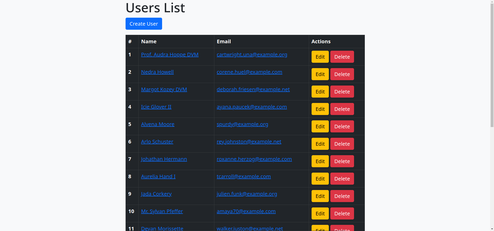
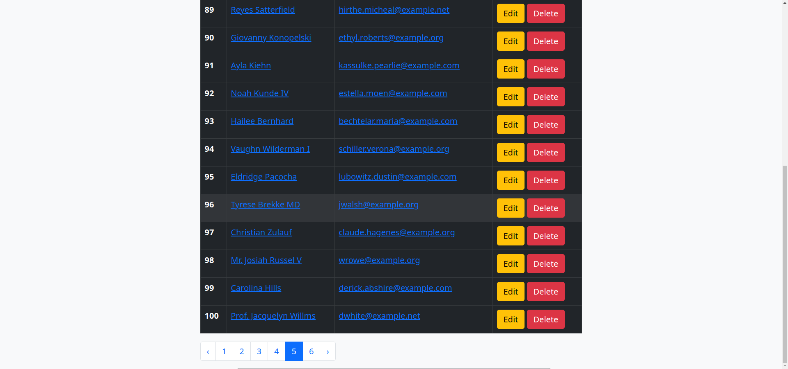
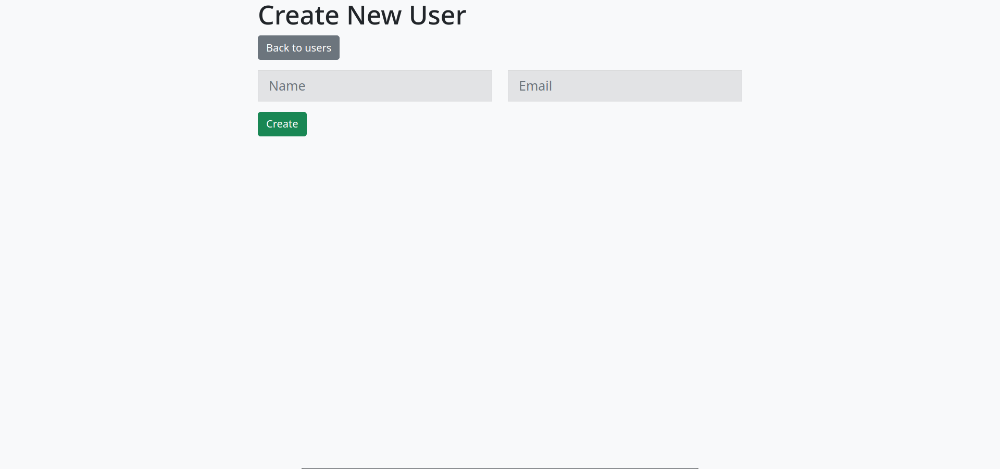
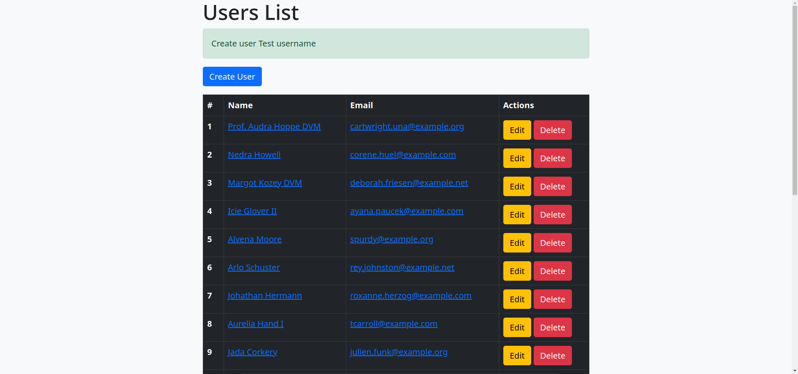
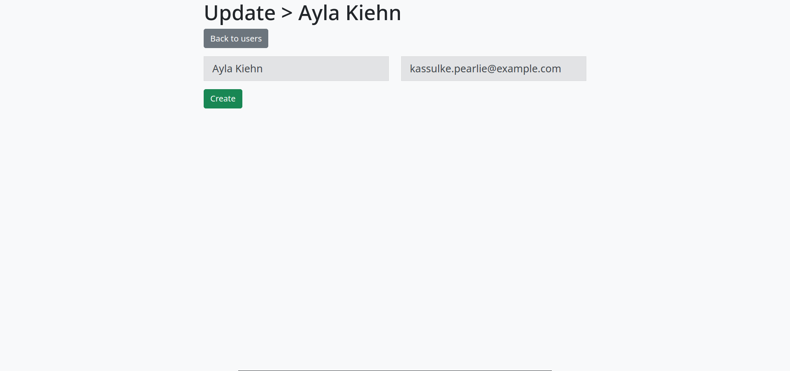
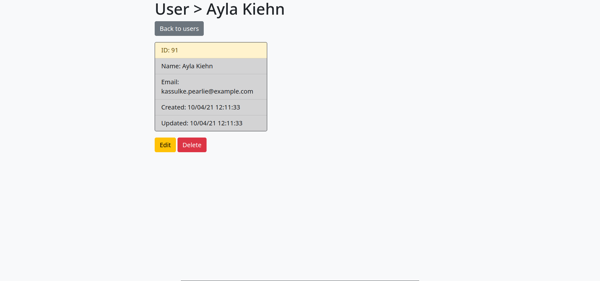

# Index page 

##Index page down

###Create form

If everything is ok, and you put the correct data.You'll see redirection and flash.

####Alert add user

#####Update 
Also you may update records and do changes you need.

######Show card
All information about user.

